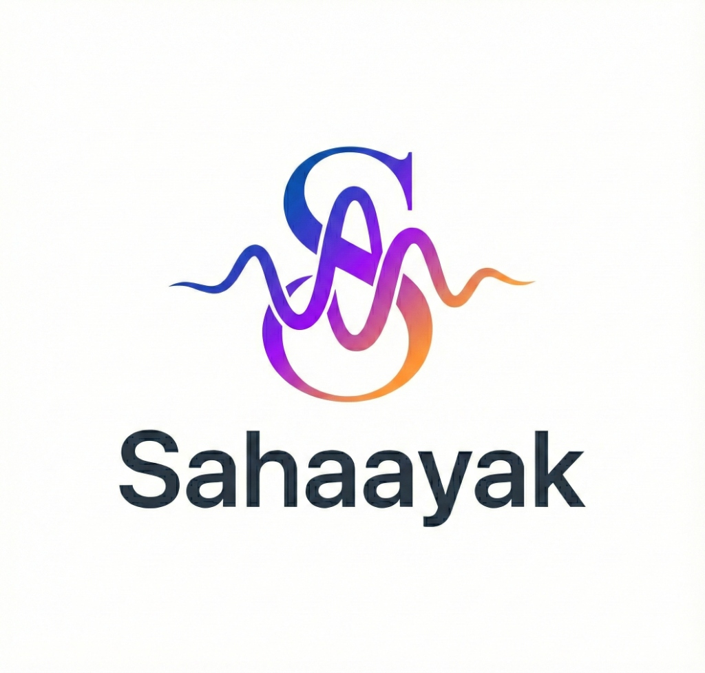

<p align="center">
  
</p>

# SAHAAYAK — Voice AI for Bharat 🇮🇳

Sahaayak is a professional, AI-powered citizen assistant designed to bridge the digital divide for rural populations in India. Featuring a sophisticated "Tactile Elite" design system, it provides a voice-first experience allowing users to seamlessly discover and navigate government schemes, subsidies, and essential services using their natural dialect.

---

## 🌟 Key Features

*   **🗣️ Voice-First Architecture:** Minimalist, highly accessible design centered around a dynamic "Liquid Mic" that responds to natural language and regional dialects.
*   **🧠 Local Intelligence Engine:** Operates via a robust `LocalEngine` for offline scheme matching, intent recognition, and dialect normalisation—ensuring privacy and functionality even without internet access.
*   **🔗 Seamless Cloud Sync:** Easily toggle between the robust offline on-device engine and a highly scalable Python/FastAPI backend via the `AICoordinator` for advanced processing.
*   **🏛️ Smart Vault:** A secure, local digital document vault featuring an animated AI OCR extraction simulation for verifying identification like Aadhaar and Ration Cards.
*   **📈 Citizen Pulse & Live Ticker:** A dynamic dashboard displaying real-time market rates for commodities, a live marquee of government news, and the user's personal engagement pulse.
*   **♿ Built for Accessibility:** Engineered with high-contrast elements, universally understood icons, and integrated screen-reader compatibilities for users of all literacy levels.
*   **🌍 Multi-lingual Core:** Deep integration of English, Hindi, and Marathi, establishing a baseline for the expansion across all of Bharat's languages.

---

## 🏗️ Technical Architecture

<table align="center">
  <tr>
    <td align="center"><b>Frontend Framework</b></td>
    <td>Flutter (Multi-platform ready)</td>
  </tr>
  <tr>
    <td align="center"><b>Backend Service</b></td>
    <td>Python / FastAPI</td>
  </tr>
  <tr>
    <td align="center"><b>Design System</b></td>
    <td>Tactile Elite (Material 3 Customizations, Glassmorphism, Silicon Soft-Shadows)</td>
  </tr>
  <tr>
    <td align="center"><b>Audio Processing</b></td>
    <td>record, flutter_tts, Custom Dialect NLP</td>
  </tr>
</table>

---

## 🚀 Getting Started

### Prerequisites
*   Flutter SDK (`3.x` or higher)
*   Android Studio / Xcode for emulators
*   Python 3.10+ (If running the backend locally)

### Installation & Run

1.  **Clone the Repository**
    ```sh
    git clone https://github.com/atharvastar1/Sahaayak.git
    cd Sahaayak/flutter_sahaayak
    ```

2.  **Fetch Dependencies**
    ```sh
    flutter pub get
    ```

3.  **Run the App**
    ```sh
    flutter run
    ```

> **Developer Note:** The application is currently set up to run brilliantly in an **Offline Simulation Mode**. To connect it to your local Python backend, simply toggle the *Offline Mode* switch within the Engineering/Simulation section of the App's Settings, or modify the `isFrontendOnly` flag under `/lib/services/ai_coordinator.dart`.

---

## 🤔 Why Sahaayak?

To empower every citizen, regardless of their technological literacy, to claim the benefits they deserve. By leveraging offline-capable AI, empathetic voice design, and premium aesthetics, Sahaayak turns the daunting task of bureaucratic navigation into a conversant, guided, and empowering journey.

---
<p align="center">
  <b>Built for Bharat. Focused on Inclusion.</b>
</p>
