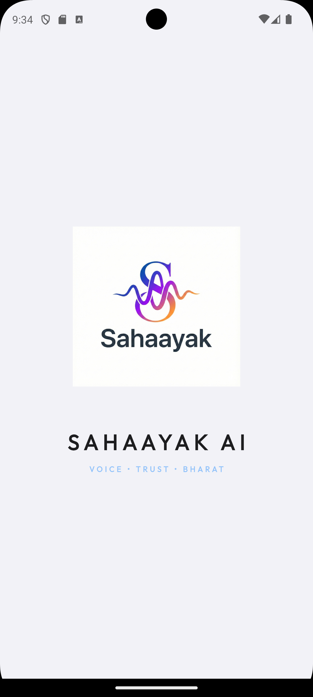
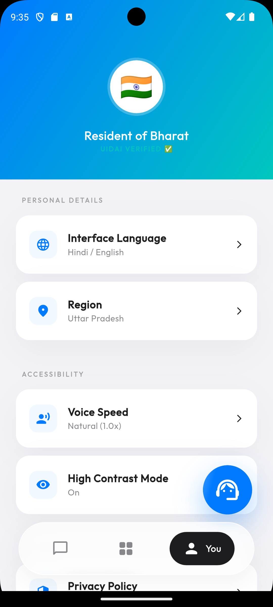
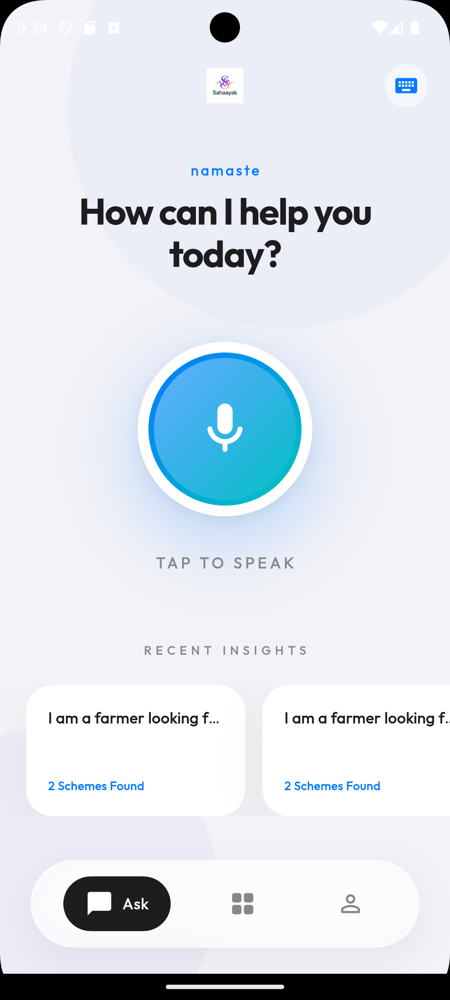

<p align="center">
  
</p>

<h1 align="center" style="font-weight: 900; letter-spacing: -1px;">
  SAHAAYAK — Voice AI for Bharat
</h1>

<p align="center">
  <i>A professional, AI-powered citizen assistant bridging the digital divide for rural populations in India.</i>
  <br/>
  <b>Tactile Elite UI</b> • <b>Offline Intelligence</b> • <b>Dialect Recognition</b> • <b>Digital Vault</b>
</p>

---

## Interface Showcase 

We designed the **"Tactile Elite"** interface for radical accessibility. Deep shadows, vibrant glassmorphism, and large touch targets ensure users of all technological literacy levels feel confident and empowered.

<p align="center">
  &nbsp;:&nbsp;
  &nbsp;&nbsp;
  
</p>
<p align="center">
  <i>(Left to Right): Accessible Language Selection, Live Citizen Dashboard, AI Voice Recognition</i>
</p>

---

## The Sahaayak Vision

Sahaayak isn't just an app; it's a dedicated public service companion. It empowers citizens to claim the benefits they deserve by replacing bureaucratic red-tape with conversational AI. 

By leveraging **offline-capable machine learning**, empathetic voice design, and premium aesthetics, Sahaayak turns the daunting task of scheme application into a guided, supportive journey.

---

## Core Capabilities

### Voice-First Architecture
Sahaayak is built from the ground up for voice. The primary interaction is driven through a vibrant **"Liquid Mic"** that pulsates, shimmers, and responds to natural language and regional dialects. It's an intelligent companion that listens.

### Local "Zero-Cloud" Intelligence 
Rural networks are unreliable. Our robust `LocalEngine` guarantees offline scheme matching, intent recognition, and dialect parsing. Privacy and functionality are preserved, even at 0 bars of cell reception.

### Seamless Cloud Synchronisation
When networks are strong, Sahaayak scales. The `AICoordinator` seamlessly toggles between the local model and our scalable **Python/FastAPI** backend for LLM-powered reasoning and Whisper STT precision.

### The Smart Vault
A secure, locally encrypted digital repository. When a citizen uploads an Aadhaar or Ration Card, our simulated AI OCR extraction runs a "Tactile Verify" sweep to validate hardware-secured records. 

### Citizen Dashboard
A dynamic hub displaying real-time market rates for vital commodities (Wheat, Rice, Diesel), an active marquee of government news updates, and real-time Citizen Pulse engagement analytics.

---

## Technical Stack

<table align="center" width="100%">
  <tr>
    <td align="center" width="25%"><b>Frontend Framework</b></td>
    <td width="75%"><code>Flutter</code> (Cross-platform compilation ready)</td>
  </tr>
  <tr>
    <td align="center"><b>Backend Service</b></td>
    <td><code>Python 3.10</code> powered by <code>FastAPI</code></td>
  </tr>
  <tr>
    <td align="center"><b>UI/UX Design</b></td>
    <td>Custom **Tactile Elite System** (Silicon shadows, Elite Color Gradients, Haptic integration)</td>
  </tr>
  <tr>
    <td align="center"><b>Audio Engine</b></td>
    <td><code>record</code>, <code>flutter_tts</code>, Speech Pipeline Optimization</td>
  </tr>
</table>

---

## Setting Up Local Development

### Prerequisites
*   **Flutter SDK** (`3.x` or higher) targetting Android/iOS.
*   **Android Studio / Xcode** for emulators or physical testing devices.
*   **Python 3.10+** (Optional: only needed if testing the live backend).

### Installation

1.  **Clone the Repository**
    ```bash
    git clone https://github.com/atharvastar1/Sahaayak.git
    cd Sahaayak/flutter_sahaayak
    ```

2.  **Fetch Flutter Packages**
    ```bash
    flutter clean && flutter pub get
    ```

3.  **Run the Experience**
    ```bash
    flutter run
    ```

> **Developer Pro Tip:** The mobile client ships with an incredibly robust **Offline Simulation Mode**. To run entirely without standardizing the Python backend, simply toggle *Offline Mode* ON within `SettingsScreen -> Engineering`, or hard-change `AICoordinator.isFrontendOnly = true`.

---

<p align="center">
  <b>Sahaayak is Built for Bharat. Focused on Inclusion.</b><br>
  <i>Crafted with care and code.</i>
</p>
